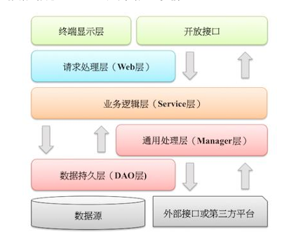

## 领域驱动（DDD）项目工程脚手架

> 
> 内置有springboot 3.2.* 、myBatis-plus、fastjson2、tutool、Dubbo、Nacos
> 
> 

```运行方式

mvn clean install

mvn archetype:generate -DarchetypeGroupId=com.eralong -DarchetypeArtifactId=eralong-archetype -DarchetypeVersion=1.0.0 -DgroupId=com.example -DartifactId=myapp


```